# 바이브코딩 2일차

## VibeCoding with LLM

### AI에게 제대로 코딩을 시키자2

#### 1. 퍼즐게임 기능 개선

- 난이도 조정,  타임아웃, 점수계산...

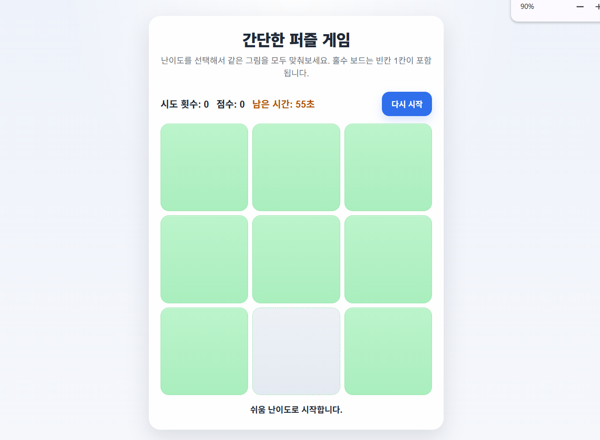

- 난이도 - 쉬움, 중간1, 중간2, 어려움 순


- 게임 시작화면


- 게임 통과화면

#### 2. PRD.md 개선

- 프롬프트로 진행한 개발 사항을 PRD.md로 재작성 요청
- 필요한 경우 PRD.md를 수정

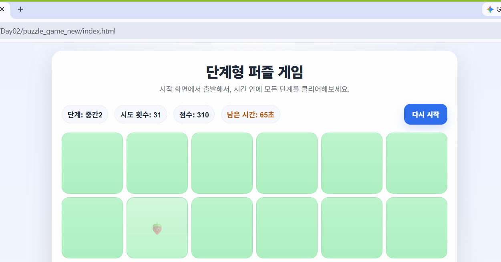

- 단계형 퍼즐게임으로 변경화면

#### 3. 디버깅

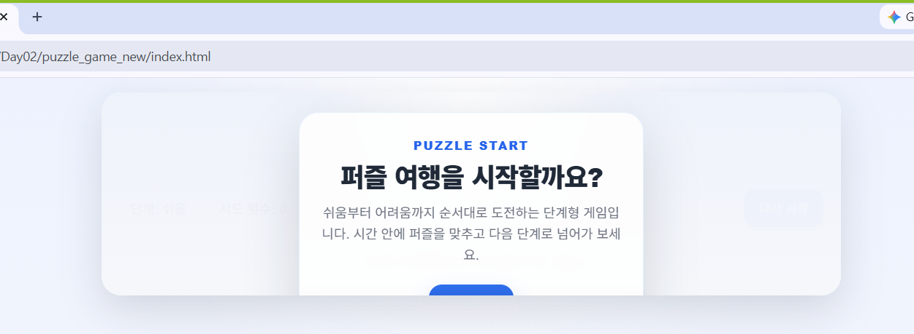

- 사진 붙여넣기 

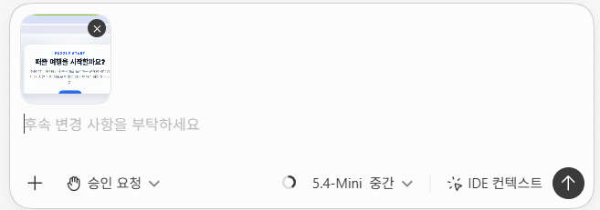

- 프롬프트로 디버깅 요청

- 에러가 나면, 추측하지 말고, 에러전체를 AI에게 던져서 원인과 해결책을 찾으라 - 안드레아 카파시

#### 4. 실습

- 유튜브 학습 기록 앱

- [PRD.md](./Day02/youtube_log/PRD.md) 작성

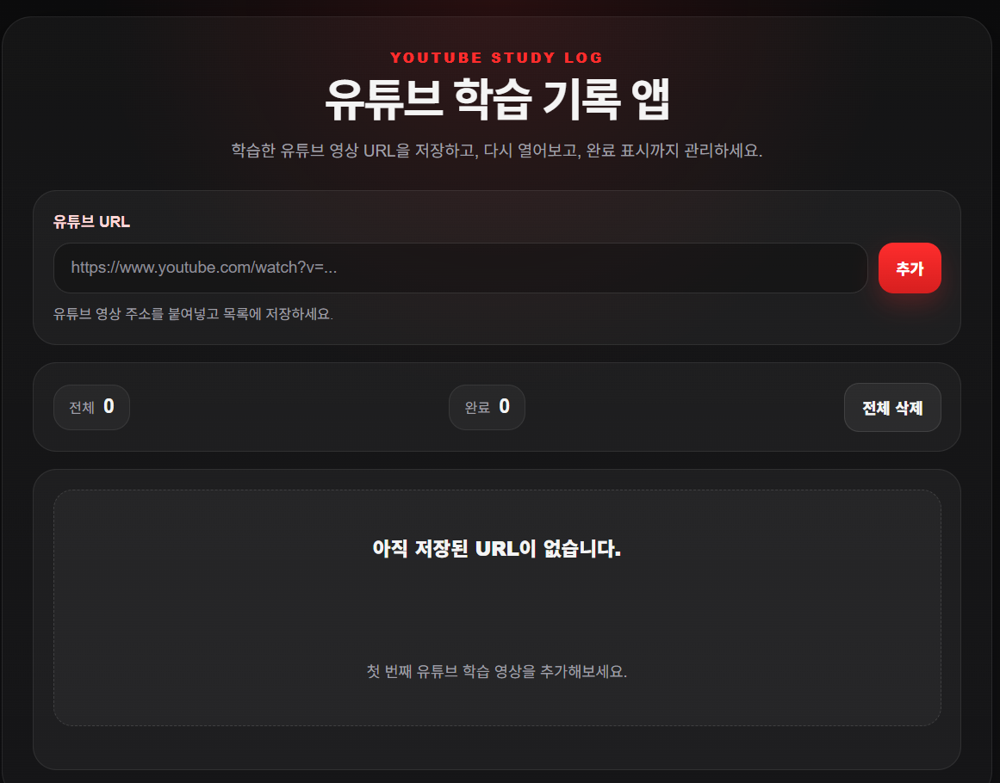

- 바이브코딩 결과

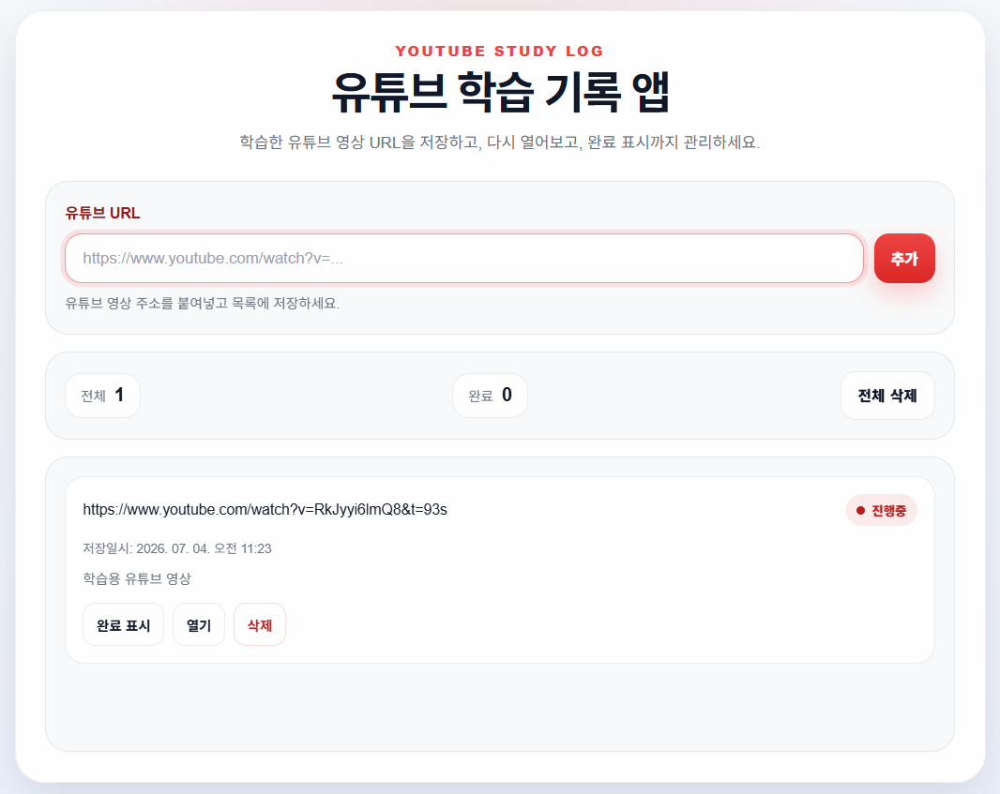

- 라이트테마로 변경

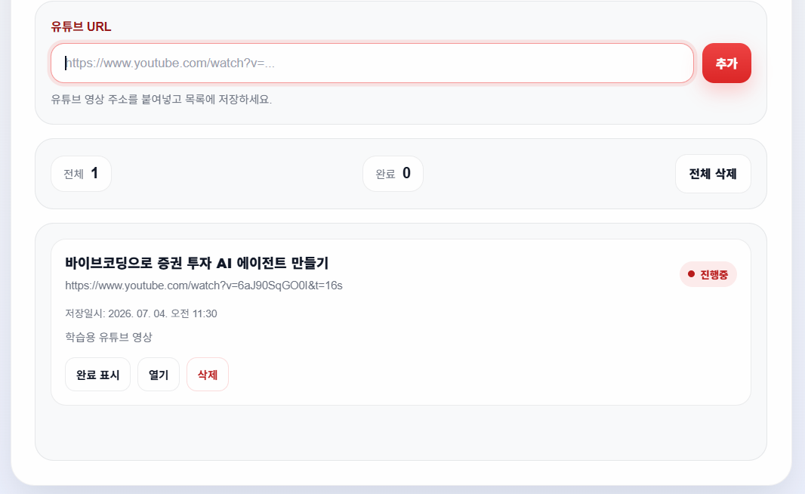

- 유튜브 제목 표시

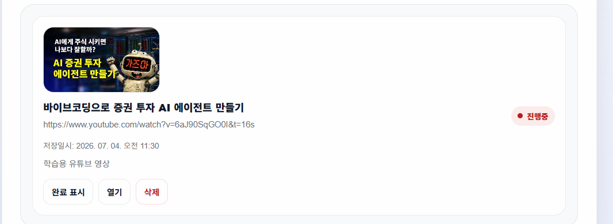

- 썸네일 표시


- 여백 정리

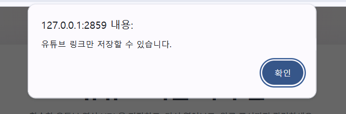

- 유튜브 링크만 저장 기능

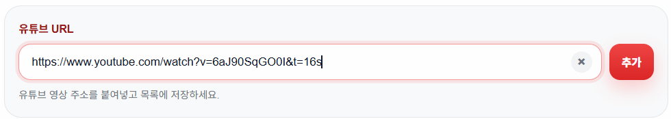

- 삭제 버튼 추가

#### 4. 배포

- 모바일 앱(플레이스토어, 앱스토어) 논외
- 웹사이트 URL로 사용자에게 오픈할 수 있는 방법
- 웹서버 생성, URL 도메인 구매, 설정...

##### 4.1. Git 설치

- https://git-scm.com/

    - Install for Windows 버튼 클릭 설치판 다운로드 
    - 설치 실행

##### 4.2. GitHub 가입

- https://github.com/ 가입 후 New
    - `Repository Name` 은 필수
    - Visibility - Public
    - `Readme` 추가 권장
    - `.gitIgnore` 개발하는 언어에 따라 선택(필수!)

##### 4.3. GitHub 리포지토리 클론

- 내 컴퓨터에 복사
    - Code 버튼 클릭
    - Clone > HTTPS 주소 복사

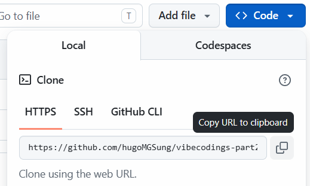

- 윈도우 탐색기 경로 선택
    - Context Menu > 터미널에서 열기 선택
   
```powershell
> git clone https://github.com/hugoMGSung/vibecodings-part2-2026.git
```

- 이전 작업 폴더 내 전체 폴더/파일을 복사한 깃허브 리포지토리 폴더로 이전

- Visual Studio Code 에서 새 폴더 열기

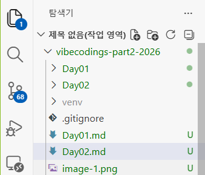

- 이전 완료 화면

##### 4.4. GitHub 푸시(업로드)

- 푸시 - 로컬 저장소 파일을 리모트 저장소(GitHub)로 업로드 하는 작업

- 소스제어 클릭
    - 변경 내용 아래 메시지 반드시 작성
    - 커밋 (X) -> 드롭다운 버튼 클릭, 커밋 및 동기화 클릭


- Github 가입, 리포지토리 생성

- Vercel 가입, 등록, 배포

#### 5. 추가 내용

#### 6. 코딩테스트

- 바이브코딩으로 프로그램 만들어보기